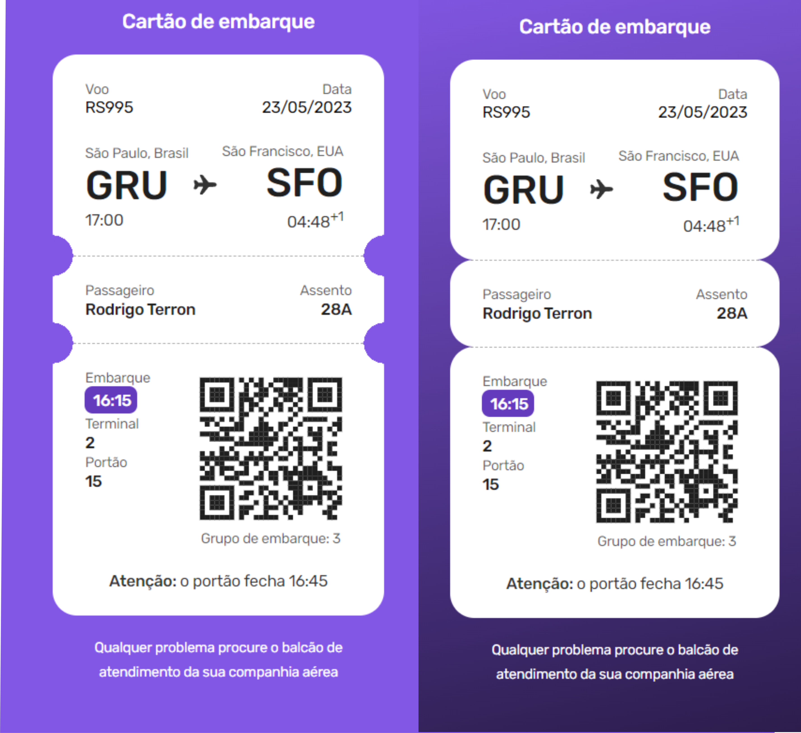

## Desafio 06 #BoraCoda - Cartão de Embarque

## :dart:  Desafio

Desafio 06 do #BoraCodar da Rocketseat, consiste na construção de um bilhete de embarque com duas versões

## :nut_and_bolt: Tech

* HTML
* CSS
* GITHUB
* GIT 

## :mailbox_closed: Contatos

> Email - rosendc30@gmail.com

> Linkedin - https://www.linkedin.com/in/francisco-rosendo-coelho/# gitfavorites
